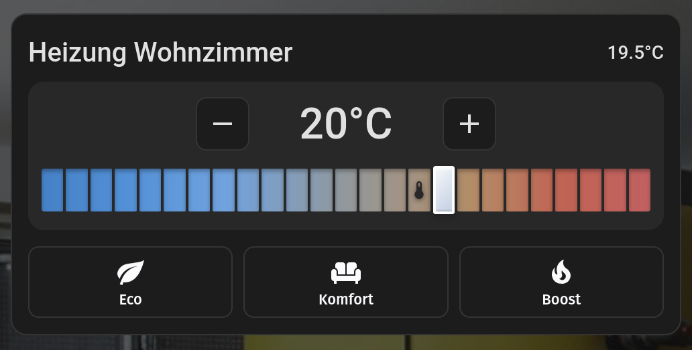
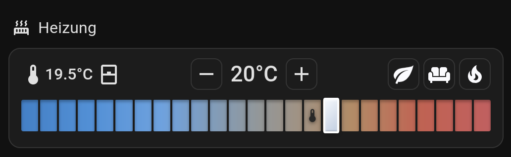

# Segmented Thermostat Card

A Home Assistant Lovelace card for `climate` entities with a **segmented step slider**: one coloured segment per selectable temperature step. The target temperature is a thumb on its segment, the measured room temperature is a small thermometer icon on its segment. Inspired by [Better Thermostat UI Card](https://github.com/KartoffelToby/better-thermostat-ui-card).

Default layout:



Compact layout (`compact: true`):



- Segmented blue-to-red slider, step size configurable (segment count follows `min_temp`, `max_temp`, `step_size`)
- `compact: true`: one row with current temperature and window state | - target + | three preset buttons, plus the slider
- Preset buttons built from the entity's own `preset_modes` (localised names, icon per preset, generic fallback icon); hidden if the entity offers none. Tapping the active preset resets it to `none` if the entity offers that
- Optional window sensor icon
- Drag / tap on the slider, arrow keys, Home/End, PageUp/PageDown, +/- buttons; debounced service calls; ARIA slider

## Installation (HACS)
1. HACS -> three dots -> **Custom repositories** -> add this repository, type **Dashboard**.
2. Install **Segmented Thermostat Card**, then reload the browser (hard refresh).

Manual: copy `dist/segmented-thermostat-card.js` to `/config/www/` and add the resource `/local/segmented-thermostat-card.js` (type: JavaScript module).

## Configuration
```yaml
type: custom:segmented-thermostat-card
entity: climate.living_room
```

| Option | Default | Description |
|---|---|---|
| `entity` | required | `climate.*` entity |
| `name` | entity name | Card title (not shown in compact mode) |
| `min_temp` | `12` | Lowest selectable temperature |
| `max_temp` | `24` | Highest selectable temperature |
| `step_size` | `0.5` | Step between segments |
| `window_sensor` | none | `binary_sensor` shown as open/closed window icon |
| `compact` | `false` | One-row layout |
| `show_current_temp` | `true` | Show the measured temperature (thermometer + value) |
| `show_window` | `true` | Show the window sensor icon (needs `window_sensor`) |
| `presets` | all offered | Filter and order the preset buttons: a list of preset names or objects (see below) |
| `debounce` | `1000` | Milliseconds before the temperature is sent to Home Assistant |

Compact example:
```yaml
type: custom:segmented-thermostat-card
entity: climate.office
window_sensor: binary_sensor.office_window
min_temp: 12
max_temp: 24
compact: true
```

### Presets
By default one button per entry in the entity's `preset_modes` (except `none`) is shown. Use `presets` to pick, order or restyle them; presets the entity does not offer are ignored:
```yaml
presets:
  - eco
  - mode: away
    name: Out
    icon: mdi:car
```
In `compact` mode the top row has three columns: left (temperature and window icon), middle (target temperature with -/+), right. Each preset can be placed with `column: left|right` (default `right`) and `align: left|right` (position within that column; default follows the column):
```yaml
presets:
  - mode: eco
    column: left
    align: right
  - mode: boost
    column: right
    align: left
```
Colours: give a preset `color_temperature: 17` to colour its button like the slider segment of that temperature (this only colours the button, it does not set any temperature on the thermostat), or `color: "#ff5722"` for an explicit CSS colour (`color` wins). Without either the button stays neutral:
```yaml
presets:
  - mode: eco
    column: left
    color_temperature: 17
  - mode: comfort
    column: right
    color_temperature: 21
  - mode: boost
    color: "#ff5722"
```
Known names (`eco`, `comfort`, `boost`, `away`, `home`, `sleep`, `activity`) get their own icon; anything else uses `mdi:tune-variant` unless you set `icon`. With many presets in `compact` mode, use `presets` to keep the row short.

## Requirements
- The climate entity must support `climate.set_temperature`. Preset buttons only appear if the entity offers `preset_modes`; they call `climate.set_preset_mode`.
- Tested in a mock harness in Chromium, Firefox and WebKit, and on a real Home Assistant 2026.9 dashboard in Chromium. Not tested on real phones or tablets.

## License
GPL-3.0-or-later, see `LICENSE`.
