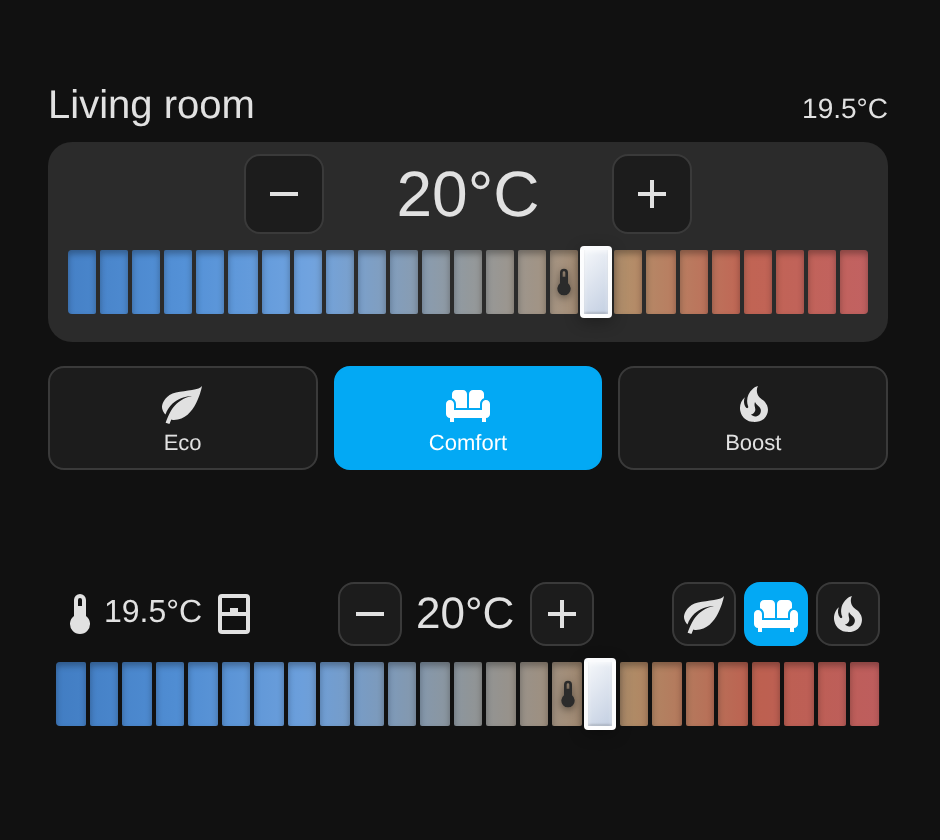

# Segmented Thermostat Card

A Home Assistant Lovelace card for `climate` entities with a **segmented step slider**: one coloured segment per selectable temperature step. The target temperature is a thumb on its segment, the measured room temperature is a small thermometer icon on its segment. Inspired by [Better Thermostat UI Card](https://github.com/KartoffelToby/better-thermostat-ui-card).



- Segmented blue-to-red slider, step size configurable (segment count follows `min_temp`, `max_temp`, `step_size`)
- `compact: true`: one row with current temperature and window state | - target + | three preset buttons, plus the slider
- Preset buttons: `eco`, `comfort`, `boost` (tapping `boost` while active switches back to `comfort`)
- Optional window sensor icon
- Drag / tap on the slider, arrow keys, Home/End, PageUp/PageDown, +/- buttons; debounced service calls; ARIA slider

## Installation (HACS)
1. HACS -> three dots -> **Custom repositories** -> add this repository, type **Dashboard**.
2. Install **Segmented Thermostat Card**, then reload the browser (hard refresh).

Manual: copy `dist/segmented-thermostat-card.js` to `/config/www/` and add the resource `/local/segmented-thermostat-card.js` (type: JavaScript module).

## Configuration
```yaml
type: custom:segmented-thermostat-card
entity: climate.living_room
```

| Option | Default | Description |
|---|---|---|
| `entity` | required | `climate.*` entity |
| `name` | entity name | Card title (not shown in compact mode) |
| `min_temp` | `12` | Lowest selectable temperature |
| `max_temp` | `24` | Highest selectable temperature |
| `step_size` | `0.5` | Step between segments |
| `window_sensor` | none | `binary_sensor` shown as open/closed window icon |
| `compact` | `false` | One-row layout |
| `debounce` | `1000` | Milliseconds before the temperature is sent to Home Assistant |

Compact example:
```yaml
type: custom:segmented-thermostat-card
entity: climate.office
window_sensor: binary_sensor.office_window
min_temp: 12
max_temp: 24
compact: true
```

## Requirements
- The climate entity must support `climate.set_temperature`; the preset buttons call `climate.set_preset_mode` with `eco`, `comfort` or `boost`, so the entity should offer those presets (otherwise the buttons do nothing useful).
- Tested in a mock harness in Chromium, Firefox and WebKit, and on a real Home Assistant 2026.9 dashboard in Chromium. Not tested on real phones or tablets.

## License
GPL-3.0-or-later, see `LICENSE`.
